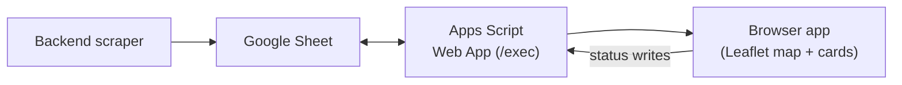
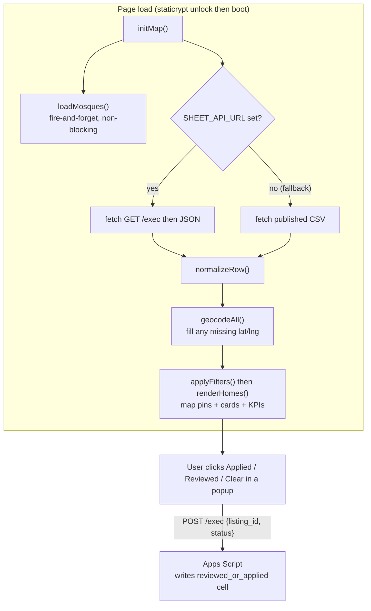

# dar-finder (frontend)

A password-protected, single-page map app for browsing Dutch rental listings. It loads
listings from a Google Sheet (kept fresh by the [`home-scrape-nl`](../../backend/home-scrape-nl)
backend), plots them on a Leaflet map colour-coded by mosque proximity, and lets the
reviewer mark each listing as Applied / Reviewed straight from the map.

Hosted on GitHub Pages at `https://yushakareem.github.io/dar-finder/`, served from `/docs`.

> **Maintaining the app?** Agent-facing conventions, the proximity-tier table, the
> security model, and step-by-step setup live in [`CLAUDE.md`](CLAUDE.md). This README
> is the human overview.

---

## Architecture at a glance

The backend scraper owns the data; a single Apps Script Web App bound to the Sheet
serves it to the browser app and accepts status writes back:



The whole frontend is one file (`index.html`) — no build step, no framework. Leaflet is
loaded from a CDN. The file is encrypted with [staticrypt](https://github.com/robinmoisson/staticrypt)
and the encrypted output (`docs/index.html`) is what GitHub Pages serves.

---

## How it works (detailed)

On page load (after the staticrypt password gate) the app boots the map, kicks off the
mosque layer without blocking, fetches listings, geocodes any with missing coordinates,
and renders. Status writes are a separate, user-triggered path:



Key points:

- **Mosques load in the background.** `loadMosques()` is fire-and-forget — if it's slow
  or fails, listings still render. Listings are the critical path.
- **Live data, no publish lag.** When `SHEET_API_URL` is set the app reads JSON from the
  Apps Script `GET /exec`, so a status write is visible on the next reload. The published
  CSV is only used as a fallback when the URL is empty (and it hides the status buttons).
- **Proximity colour is server-driven.** Card and pin colour come from the backend's
  `closest_mosque_status` column; the frontend only recalculates if that column is
  missing. The proximity filter is multi-select. See [`CLAUDE.md`](CLAUDE.md) for the
  full tier table.
- **Status writes** (Applied / Reviewed / Clear) `POST` to the same `/exec` endpoint,
  which writes the row's `reviewed_or_applied` cell. The backend treats that column as
  protected, so frontend writes survive scrape runs.

---

## Editing and deploying

The served file is the encrypted `docs/index.html`. To ship a change:

1. Edit the unencrypted source `index.html` (local only — it is gitignored and never committed).
2. Re-encrypt into `docs/`:
   ```sh
   npx staticrypt index.html -o docs/index.html
   ```
3. Commit and push **only** `docs/`:
   ```sh
   git add docs/ && git commit -m "update app" && git push
   ```

GitHub Pages serves from `/docs`, so the push is the deploy.

---

## Google Sheet integration

A single Apps Script Web App (`apps-script/Code.gs`), bound to the listings spreadsheet,
handles both reads and writes:

- `GET /exec` → returns all listings as JSON (the live dataset on page load).
- `POST /exec {listing_id, status}` → writes the row's `reviewed_or_applied` cell.

To wire it up, set `const SHEET_API_URL = 'https://script.google.com/macros/s/<deployment-id>/exec';`
in `index.html`, then re-encrypt and push `docs/`. Full one-time deployment steps
(creating the Web App, access settings, redeploying) are in [`CLAUDE.md`](CLAUDE.md).

---

## Repo layout

```
/
├── docs/index.html      # staticrypt-encrypted app — served by GitHub Pages
├── apps-script/Code.gs  # Apps Script Web App (deploy in the Apps Script editor)
├── index.html           # unencrypted source — local only, never committed
├── .staticrypt.json     # staticrypt salt (safe to commit; no password)
├── .secrets/            # local-only password store — never committed
└── CLAUDE.md            # maintenance + conventions + security notes
```
